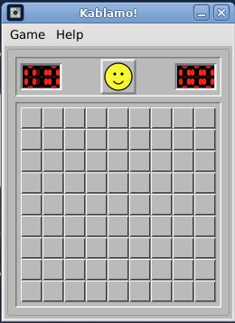

# Kablamo!

**Vended by Grok Build**



A **Minesweeper** for The Lunduke Computer Operating System (LCOS). The window is Windows 3.1 / 95 Minesweeper.

Binary: `kablamo`. Unlicense.

LCOS itself: [https://github.com/BryanLunduke/LCOS](https://github.com/BryanLunduke/LCOS)


## Status

**v0.1.4 (M0–M3).** 9×9 Minesweeper: first-click safe, flags, Win95 LCD and face. Headless test suite and BUG-BACKLOG.md. See [INSTALL.md](INSTALL.md).

| Doc | What |
|---|---|
| [DEVELOPMENT.md](DEVELOPMENT.md) | Locked decisions, architecture, milestones M0–M3, branching, semver, lint |

## Build

```
sudo apt install build-essential meson ninja-build pkg-config g++ libgtkmm-3.0-dev clang-format cppcheck
meson setup build
meson compile -C build
./build/kablamo
```

### macOS

Homebrew's GTK3 draws through Quartz, so no X server is needed.

```
brew install gtkmm3 meson ninja pkgconf clang-format cppcheck
meson setup build
meson compile -C build
./build/kablamo
```

It runs as a plain GTK window: no global menu bar, Ctrl shortcuts rather than Cmd, and no `.app` bundle.

PR lint gate: `./scripts/lint.sh` (CI runs this; no `--fix`). Format `src/` locally with `./scripts/lint.sh --fix`.

Install: [INSTALL.md](INSTALL.md).

## License

[The Unlicense](https://unlicense.org). See [UNLICENSE](UNLICENSE).
